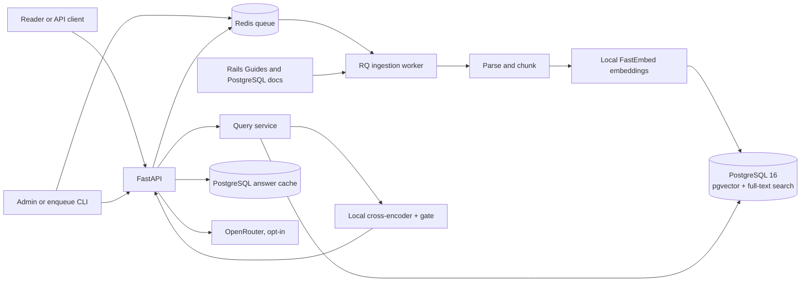
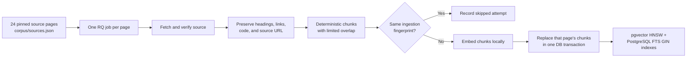
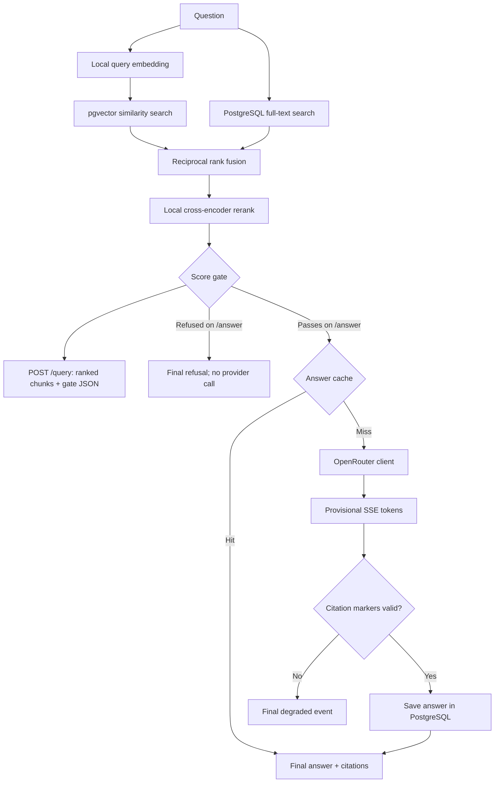
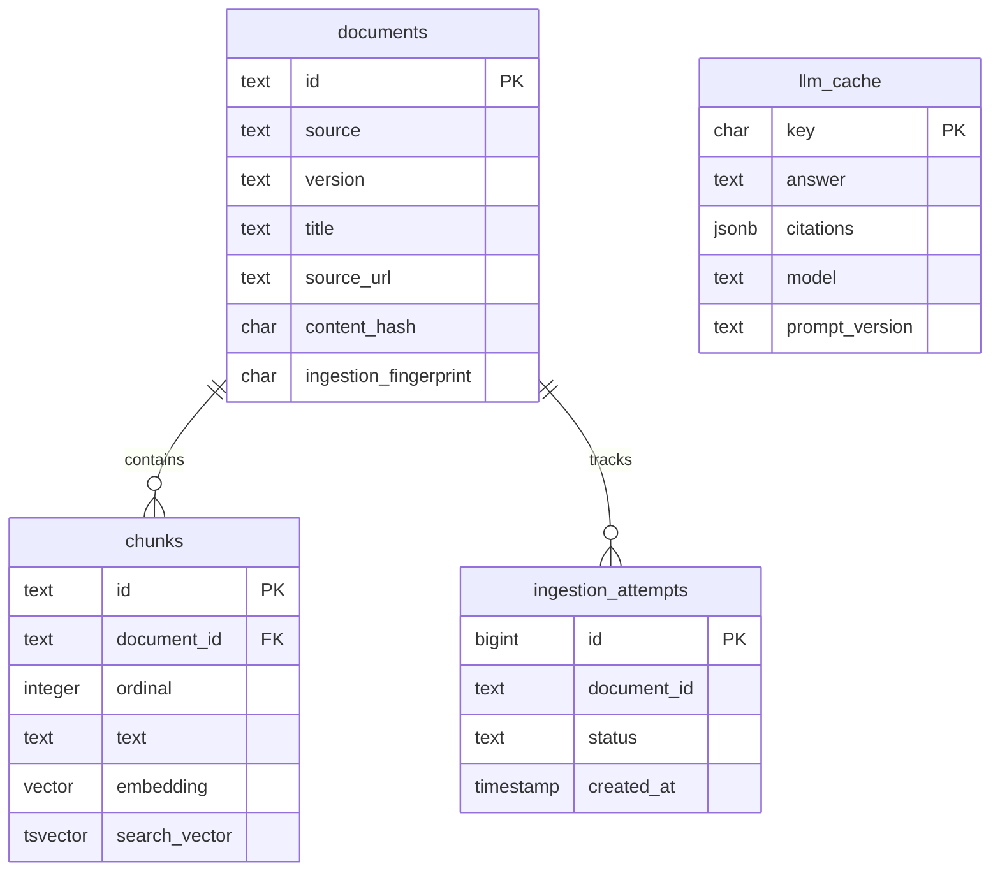

# Ask the Docs

A portfolio RAG service built with Python and FastAPI. It answers questions about selected **Rails Guides** and **PostgreSQL 16** documentation, shows its sources, and exposes the retrieval steps so they can be inspected separately from generation.

**Try `/query` to inspect retrieved passages. Try `/answer` for a streamed, cited answer.** Ingestion, embeddings, search, reranking, and evaluation run locally. Only an opted-in `/answer` cache miss calls OpenRouter.

| Route | What it returns | External model call? |
| --- | --- | --- |
| `GET /health` | Database readiness | No |
| `POST /ingest` | Redis job IDs for one page or the catalog; requires `X-Admin-Key` | No |
| `POST /query` | Ranked source chunks, scores, and gate decision as JSON | No |
| `POST /answer` | Sources, provisional tokens, then a final SSE event | Only on an ungated cache miss with a configured key and model |

## Architecture



The API and worker are separate Compose services. [dbmate migrations](db/migrations) create the database objects; [the schema snapshot](db/schema.sql) shows their current shape. Redis holds ingestion jobs, while PostgreSQL holds page metadata, chunks, embeddings, ingestion attempts, and cached answers. The local model files live in an ignored `models/` directory or Compose volume.

### How documentation becomes searchable



The fingerprint covers source bytes and pipeline settings. Re-ingesting unchanged pages skips embedding; a changed page replaces its chunks atomically. Each chunk keeps its document ID, title, heading path, and source URL, so retrieval can return a useful citation. You can also [download](scripts/download_corpus.py) and [prepare](scripts/prepare_corpus.py) the corpus into ignored local files without enqueuing jobs.

### How a question becomes an answer



Vector and keyword searches run in parallel. The first search uses local 384-dimensional BGE embeddings; the second uses PostgreSQL `websearch_to_tsquery`. If the whole-question keyword search finds nothing, it retries with a small OR query of content terms. Explicit quoted phrases and `OR` searches keep their original behavior. The lists are fused with RRF, and a local MiniLM cross-encoder reranks the best candidates. The default gate threshold is 1.5; a score strictly below it refuses generation. Raw reranker scores are **not probabilities**.

`/answer` emits `sources`, optional `token` events, and one `done` event. Tokens are provisional; a client should accept the answer only when `done.status` is `generated` or `cached`. Citation checking verifies that each numbered marker names a supplied passage. It cannot establish that every claim is supported by that passage; see the [answer-support cases](evals/README.md#small-answer-support-check).

## Run a local demo

Docker Compose starts PostgreSQL with pgvector, Redis, dbmate, the FastAPI app, and the RQ worker:

```sh
cp .env.example .env
docker compose up -d --build
docker compose exec app python -m scripts.enqueue_corpus --document-id postgresql:indexes-intro
docker compose logs -f worker
```

The first ingestion downloads the local embedding model. Stop following logs after the job completes. The API runs at `http://127.0.0.1:8000`; [`/docs`](http://127.0.0.1:8000/docs) is the interactive API reference. PostgreSQL is exposed to the host on port `55432` by default.

**Inspect retrieval first:**

```sh
curl --fail --silent --show-error \
  -H 'Content-Type: application/json' \
  -d '{"question":"How does an index on the id column help PostgreSQL find rows in test1?","top_k":5}' \
  http://127.0.0.1:8000/query
```

The JSON includes the source text and URL, vector/keyword ranks, fused score, rerank score, and gate decision. `top_k` defaults to 5 and accepts 1–20; questions accept at most 500 characters. `/query` never generates an answer.

**Stream an answer:** set `OPENROUTER_API_KEY` and `LLM_MODEL` in your ignored `.env`, then recreate the app container so it receives the new values (`docker compose up -d --force-recreate app`).

```sh
curl -N --fail --silent --show-error \
  -H 'Content-Type: application/json' \
  -d '{"question":"How does an index on the id column help PostgreSQL find rows in test1?"}' \
  http://127.0.0.1:8000/answer
```

A cache hit does not call the provider. Without a configured key and model, `/answer` still returns sources and finishes with `not_configured`. `CONTEXT_CHUNKS` (default 4), `CONTEXT_TOKENS_PER_CHUNK` (300), and `MAX_OUTPUT_TOKENS` (512) bound the request; there is no daily spending tracker. Check the current [OpenRouter model pricing](https://openrouter.ai/models) before choosing a model.

**See the stream in a browser:** open [`/demo/`](http://127.0.0.1:8000/demo/) after starting the app. The small chat UI shows search progress, source links, arriving text, and the verified final answer. Its turns are independent; the API does not accept conversation history. Swagger's `/docs` page displays the raw SSE response rather than a chat interface.

| SSE event | Frontend action |
| --- | --- |
| `progress` | Show a short stage message: searching, reviewing sources, writing, or checking citations. These are user-visible status updates, not private model reasoning. |
| `sources` | Show the retrieved title, heading, URL, and citation marker. |
| `token` | Append `data.text` to a **provisional** draft. |
| `done` | Replace the draft with `data.answer` for `generated`, `cached`, or `gated`. For `not_configured`, `provider_error`, or `invalid_citations`, discard the draft and show the status. |

For a custom frontend, copy the framework-independent [stream client](app/static/answer-stream.js) or use it directly from the same origin:

```js
import { streamAnswer } from "/demo/answer-stream.js";

let draft = "";
await streamAnswer("How do PostgreSQL indexes help?", ({ type, data }) => {
  if (type === "progress") showStatus(data.message);
  if (type === "sources") showSources(data.sources);
  if (type === "token") showDraft(draft += data.text);
  if (type === "done") {
    if (["generated", "cached", "gated"].includes(data.status)) {
      showFinal(data.answer, data.citations);
    } else {
      clearDraft();
      showError(data.status);
    }
  }
});
```

The endpoint stays `POST /answer`: browser `fetch()` can stream its SSE response while keeping the question out of a URL. Native `EventSource` only sends GET requests and can reconnect automatically, which could repeat a provider call. For a frontend on another origin, set `CORS_ORIGINS=http://localhost:5173` (or a comma-separated list of trusted origins) in `.env` and recreate `app`.

**Ingest the full catalog** when you want questions spanning both documentation sets:

```sh
docker compose exec app python -m scripts.enqueue_corpus
```

`POST /ingest` is another way to enqueue pages. Set `INGEST_ADMIN_KEY` in `.env`, recreate `app`, and send `X-Admin-Key` with `{"document_id":"rails:getting_started"}` or `{}` for all pages. The CLI above needs no HTTP admin key. Worker attempts and errors are stored in `ingestion_attempts`.

## Storage and code map



`ingestion_attempts.document_id` records the source ID without a foreign key. `llm_cache` is keyed by the normalized question, ordered chunk IDs, context hash, model, prompt version, and output cap. Its citations refer to source chunk IDs; it has no foreign key to `chunks` because cache entries may outlive a re-ingestion. [SQL migrations](db/migrations) are authoritative; [`db/schema.sql`](db/schema.sql) is a dbmate snapshot for inspection and loading a fresh database. The checked-in snapshot contains schema and migration versions, no corpus rows or credentials.

| Area | Responsibility | Familiar Ruby analogue |
| --- | --- | --- |
| [`app/api`](app/api) | Thin FastAPI request/response adapters | Controllers |
| [`app/ingestion`](app/ingestion) | Source parsing, chunking, embeddings, jobs, persistence | Jobs + service objects |
| [`app/retrieval`](app/retrieval) | Vector/keyword repositories, fusion, reranking, gate | Query objects + services |
| [`app/generation`](app/generation) | Prompt, OpenRouter client, citation check, cache workflow | API client + service object |
| [`evals`](evals) | Offline retrieval and answer checks | Test fixtures and benchmarks |

The OpenRouter client owns provider HTTP details; the answer service coordinates it with retrieval and persistence. `pyproject.toml` and `uv.lock` play the role of a Gemfile and lockfile.

## Evidence and limits

The [retrieval evaluation](evals/README.md) uses 50 answerable and 10 unanswerable questions over 24 selected pages (785 chunks). The table shows curated gold-document hit@5, meaning a gold page appears among the first five chunks; it does **not** measure answer correctness.

| Retrieval mode | Original baseline | After keyword fallback |
| --- | ---: | ---: |
| Vector only | 47/50 | 47/50 |
| Keyword only | 8/50 | 34/50 |
| RRF hybrid | 47/50 | 44/50 |
| Hybrid + rerank | 48/50 | 48/50 |

The fallback helps the keyword branch, but final reranked hit@5 is unchanged and the intermediate fused list is noisier. With the existing threshold, the new run refused 7/10 unanswerable and 2/50 answerable questions. The threshold was calibrated before this retrieval change, on the same small question set, so those refusal counts are not a general reliability estimate. The [offline answer cases](evals/README.md#small-answer-support-check) also show one real cached answer with a valid citation marker and an unsupported claim.

Reproduce checks without a paid model call:

```sh
uv run python -m evals.run_answer_evals
uv run ruff check .
uv run ruff format --check .
uv run mypy app evals
uv run pytest
```

For the full retrieval comparison, follow [the evaluation setup](evals/README.md#run-the-retrieval-comparison). PostgreSQL integration tests are opt-in locally with `RUN_INTEGRATION_TESTS=1 uv run pytest -m integration`; CI runs them against pgvector.

## Local development and source attribution

Install [uv](https://docs.astral.sh/uv/) and [dbmate](https://github.com/amacneil/dbmate) for host-based commands. `uv sync` installs the Python environment; `docker compose up -d db redis`, `dbmate migrate`, and `uv run uvicorn app.main:app --reload` run the API outside Compose. Set `DATABASE_URL` and `REDIS_URL` for the host, as in `.env.example`. The Compose `migrate` service applies migrations automatically. If you change the PostgreSQL host port, update both `POSTGRES_PORT` and the port in `DATABASE_URL`. Changing the initial database role or name after the data volume is created requires a new volume or manual database changes.

The catalog points to [Rails 8.1.4 source at commit `c3466ea`](https://github.com/rails/rails/tree/c3466ea00d7121798e3aa3144ffdf7174b81d8cb/guides/source) and the published [Rails 8.1 Guides](https://guides.rubyonrails.org/v8.1/). Rails uses the [MIT license](https://github.com/rails/rails/blob/v8.1.4/MIT-LICENSE). PostgreSQL pages point to the official [version 16 documentation](https://www.postgresql.org/docs/16/); that major-version URL can receive patch updates, so the local download manifest records exact bytes. PostgreSQL documentation uses the [PostgreSQL License](https://www.postgresql.org/about/licence/) (copyright © 1996–2026 The PostgreSQL Global Development Group and © 1994 The Regents of the University of California). Keep upstream attribution and notices with any redistributed corpus. This repository contains links and tooling, not downloaded pages.

The service code is MIT licensed. Development happens in [small, focused PRs](AGENTS.md), each explaining What, Why, and How.
